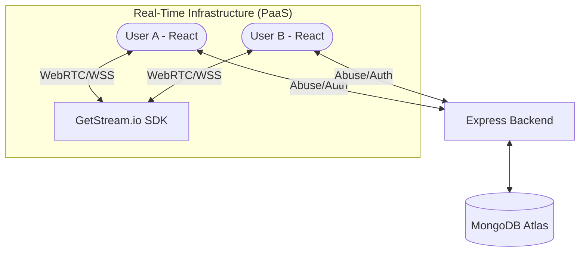
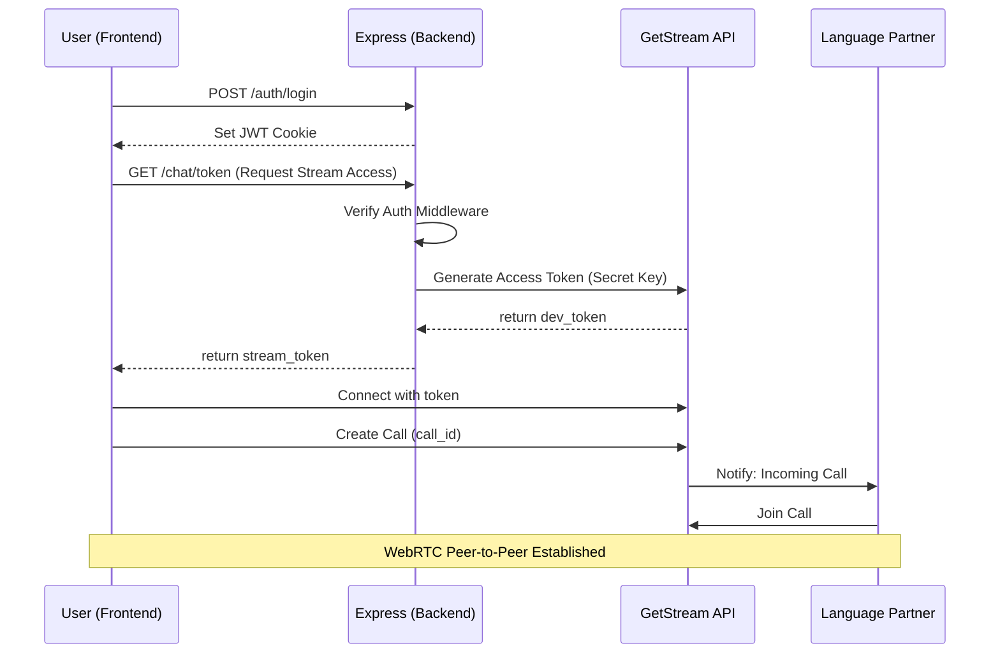

# 🌍 Streamify

**Streamify** is a real-time language exchange platform built for people who want to learn new languages and help others with their native language proficiency. It enables users to chat and video call with language partners, complete onboarding profiles, and personalize their experience with dynamic themes.

---

## ✨ Features

- 🧑‍🏫 Onboarding with bio, location, and language preferences  
- 💬 Real-time chat powered by Stream Chat SDK  
- 📹 Video calling via Stream Video SDK  
- 🤝 Friend requests and smart user recommendations  
- 🎨 Theme customization with DaisyUI and Zustand  
- 🔐 Secure authentication using JWT and cookies  

---

## 🧰 Tech Stack

| Layer            | Technologies & Tools                                                                 | Version Used       |
|------------------|--------------------------------------------------------------------------------------|--------------------|
| **Frontend**     | React · Vite · Zustand · React Query · Lucide Icons                                  | React (latest)          |
| **Styling**      | TailwindCSS · DaisyUI                                                                | TailwindCSS `3.4.17`<br>DaisyUI `4.12.14` |
| **Backend**      | Express · MongoDB · Mongoose · JWT · Stream SDK                                      | Express (latest)         |
| **Routing**      | React Router                                                                         | latest                |
| **State Mgmt**   | Zustand · React Query                                                                | Zustand (latest)         |

---

## 📦 Additional Dependencies

| Package               | Purpose                                                                 |
|------------------------|-------------------------------------------------------------------------|
| `axios`               | Handles HTTP requests from frontend to backend                          |
| `react-hot-toast`     | Displays toast notifications for user feedback                          |
| `stream-chat-react`   | Stream Chat SDK for real-time messaging UI                              |
| `@stream-io/video-react-sdk` | Stream Video SDK for video calling UI                        |
| `nodemon` *(dev)*     | Automatically restarts backend server on file changes                   |

---

## ⚠️ Styling Compatibility Notice

> Streamify is tightly coupled with specific versions of TailwindCSS and DaisyUI.  
> Using newer versions may break theme rendering or layout.

## 🏗️ System Architecture

Streamify uses a decoupled architecture where the local backend handles authentication and Metadata, while the specialized **GetStream.io** PaaS handles the high-concurrency RTC (Real-Time Communication) and Messaging traffic.



---

## 🔄 RTC Signaling & Call Workflow

The following sequence illustrates how a secure video session is initiated:



---

## 📂 Project Structure Map

```
📁 streamify
├── 📁 frontend              # React + Vite Client
│   ├── 📁 src
│   │   ├── 📁 components    # Logic-less UI & Layouts
│   │   ├── 📁 pages         # Routing Entry Points (Chat, Call, Home)
│   │   ├── 📁 store         # Zustand (App State & Theme)
│   │   ├── 📁 hooks         # React Query & Custom Logic
│   │   └── 📄 App.jsx       # Auth Guard & Route Mapping
│   └── 📄 tailwind.config.js # Custom DaisyUI Themes
│
└── 📁 backend               # Express.js Server
    ├── 📁 src
    │   ├── 📁 controllers   # API Logic (Auth, Friend Requests)
    │   ├── 📁 models        # MongoDB / Mongoose Schemas
    │   ├── 📁 middleware    # JWT & Session Validation
    │   └── 📄 server.js     # Entry & Socket Initialization
```

---

## ⚙️Setup Instructions

### 🧩 1. Frontend Setup


```
cd frontend

# Create Vite project then choose React and JavaScript
npm create vite@latest .

npm install

npm install -D tailwindcss@3 postcss autoprefixer
npx tailwindcss init -p

npm install -D daisyui@4.12.14

npm install react-router-dom react-hot-toast @tanstack/react-query axios lucide-react zustand stream-chat stream-chat-react @stream-io/video-react-sdk
```


### 🛠️ 2. Backend Setup


```
cd backend

# Initialize Node project
npm init -y

# Copy `package.json` from the project repo before installing dependencies
npm install
```


### 🔐 3. Generate Stream API Key


```
openssl rand -base64 32
```
Paste the output into both `.env` files:

`frontend/.env`
```ENV
VITE_STREAM_API_KEY=your_generated_stream_key
```

`backend/.env`
```ENV
PORT=5001
MONGO_URI=your_mongodb_uri
STREAM_API_KEY=your_generated_stream_key
STREAM_API_SECRET=your_stream_api_secret
JWT_SECRET_KEY=your_jwt_secret
NODE_ENV=production
```

✅ `STREAM_API_KEY` and `VITE_STREAM_API_KEY` share the same value generated from `openssl rand -base64 32`.


### 🖼️ 4. Branding Asset


Use [i.png](https://storyset.com/illustration/video-call/bro) with primary color set to `#1FB854` for consistent branding.


## ✅ Status


Streamify is production-ready, scalable, and built with modern best practices. It’s a platform where language learners and native speakers connect, converse, and grow together.

---

## 🛡️ License

This project is licensed under the [MIT License](LICENSE). You are free to use, modify, and share this project with proper attribution.

## 🌟 About Me

Hi there! I'm Kairav Singh.. I’m an IT professional and passionate YouTuber on a mission to share knowledge and make working with data enjoyable and engaging!
